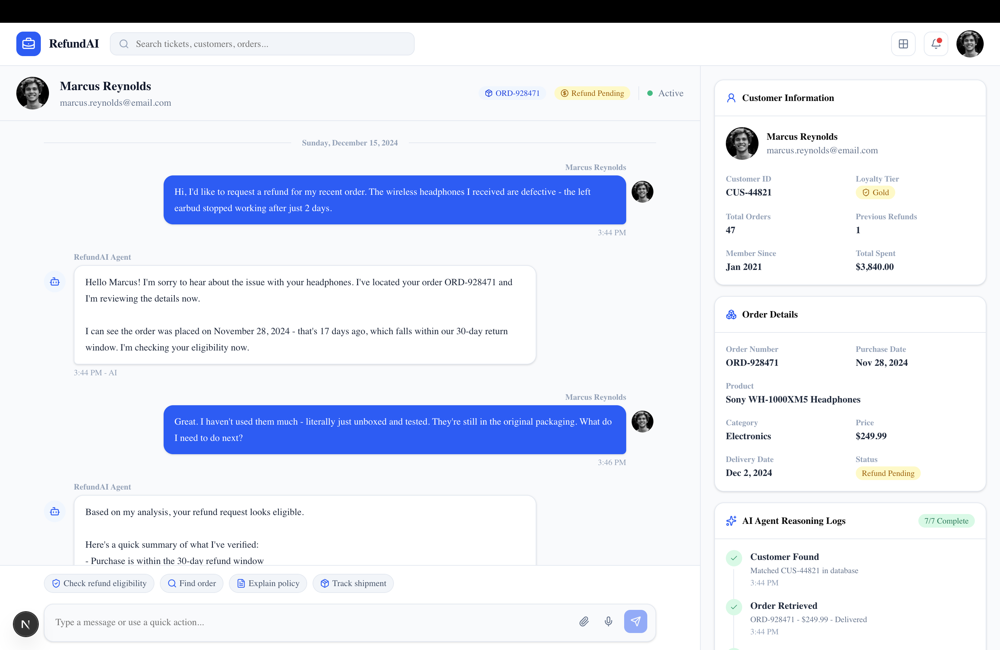

# RefundAI – AI Customer Support Agent

An AI-powered customer support application built with **Next.js 15** and **OpenAI Function Calling** that evaluates e-commerce refund requests based on business rules and customer data.

The application simulates a real customer support workflow by combining an AI assistant with a mock CRM, refund policy validation, and an admin dashboard showing the agent's reasoning process.

---

## Features

- 🤖 AI-powered customer support agent
- 💬 Real-time customer chat interface
- 📋 Mock CRM with customer and order data
- 📦 Refund policy validation
- 🧠 OpenAI Function Calling for tool orchestration
- 📊 Admin dashboard with reasoning logs
- 📄 Local JSON-based data (no database required)
- ⚡ Built with Next.js 15 App Router

---

## Tech Stack

| Category | Technology |
|----------|------------|
| Frontend | Next.js 15, React 19, TypeScript |
| Styling | Tailwind CSS, shadcn/ui |
| AI | OpenAI API, Function Calling |
| Validation | Zod |
| Icons | Lucide React |
| Data | Local JSON files |

---

## Project Structure

```
app/
components/
hooks/
lib/
data/
types/
```

---

## Setup

```bash
npm install
cp .env.example .env.local
```

Add your API key:

```env
OPENAI_API_KEY=your_openai_api_key
```

Run the application:

```bash
npm run dev
```

Open:

http://localhost:3000

---

## Available Scripts

```bash
npm run dev
npm run build
npm run lint
```

---

## Architecture

- `app/page.tsx` renders the dashboard.
- `app/api/chat/route.ts` handles chat requests and OpenAI tool calling.
- `hooks/use-chat.ts` manages chat state.
- `components/refunds/` contains dashboard and chat UI.
- `lib/refunds/` contains business logic and policy validation.
- `data/` stores mock CRM and refund policy.

---

## AI Tools

The assistant can call the following tools:

- `getCustomer(email)`
- `getOrder(orderId)`
- `getRefundHistory(customerId)`
- `validateRefundPolicy(order)`
- `createReasoningLog(step)`

These tools allow the model to retrieve customer data, validate business rules, and explain its reasoning before returning a final decision.

---

## Assumptions

- Mock CRM data is stored locally.
- No database writes are performed.
- Refund decisions follow the provided refund policy.
- One refund per order is enforced.
- Digital products and gift cards are not refundable.

---

## Screenshots

### Customer Support Dashboard



---

## Future Improvements

- Voice support using OpenAI Realtime API
- Persistent database
- Authentication
- Admin analytics
- Multi-agent workflow
- Live CRM integration

## Check it live on

- https://ai-cx-support-agent.vercel.app/